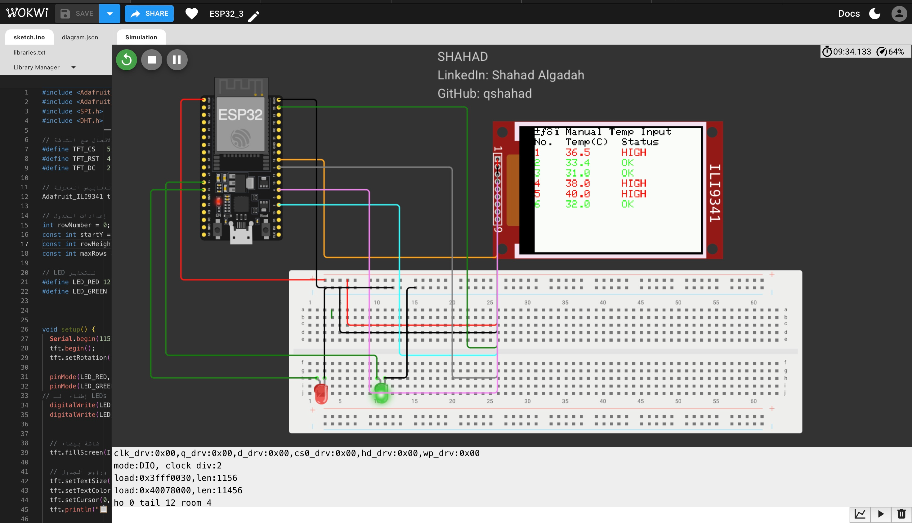

# ESP32_ILI9341
Manual temperature input display using ESP32 + ILI9341 + LEDs
# Patient Temperature Classification with ESP32 + ILI9341

This project uses an **ESP32** microcontroller and an **ILI9341 TFT display** to classify patient temperatures based on manual input via the Serial Monitor. It visually presents the data in a color-coded table and activates LEDs based on the input temperature.

---

## 💡 Features

- Manual temperature input via **Serial Monitor**
- Automatically updates a table on the **TFT screen**
- Displays temperature readings and status (**OK** / **HIGH**)
- 🔴 **Red LED** turns ON if temperature > 35°C  
- 🟢 **Green LED** turns ON if temperature ≤ 35°C  
- Command `clear` resets the screen
- Display is rotated **horizontally** (landscape)

---

## 🖥️ Display Layout

| No. | Temp (°C) | Status |
|-----|-----------|--------|
| 1   | 36.4      | HIGH   |
| 2   | 34.7      | OK     |
| ... | ...       | ...    |

- Text is color-coded:
  - 🔴 Red for HIGH temperature (> 35°C)
  - 🟢 Green for OK temperature (≤ 35°C)
  - ⚫ Black for headers

---

## 🖼️ Project Output Example

This image shows the actual result of the system displaying temperatures on the TFT screen:



---

## 🔌 Components Used

- ESP32 Dev Board
- ILI9341 TFT Display (SPI interface)
- 2 LEDs (Red & Green) with 220Ω resistors
- Breadboard and jumper wires

---

## 📥 Serial Commands

| Command | Action                        |
|---------|-------------------------------|
| `36.5`  | Adds a new temperature entry  |
| `clear` | Resets the screen and table   |

---

## ⚙️ How It Works

1. User enters a temperature (e.g., `34.8`) in the Serial Monitor.
2. The system adds the temperature and its status to the table.
3. Based on the value, it turns on the **red** or **green** LED.
4. After 10 rows, the screen automatically resets.

---

## 🧠 Key Code Snippet

```cpp
if (temp > 35.0) {
  tft.setTextColor(ILI9341_RED);
  digitalWrite(LED_RED, HIGH);
  digitalWrite(LED_GREEN, LOW);
} else {
  tft.setTextColor(ILI9341_GREEN);
  digitalWrite(LED_RED, LOW);
  digitalWrite(LED_GREEN, HIGH);
}
```

## 🔗 Live Simulation (Wokwi)

You can try this project directly in the Wokwi simulator:

👉 [Open in Wokwi](https://wokwi.com/projects/435286436648704001)

---

## 👤 Author

**Shahad Algadah**  
GitHub: [@qshahad](https://github.com/qshahad)


